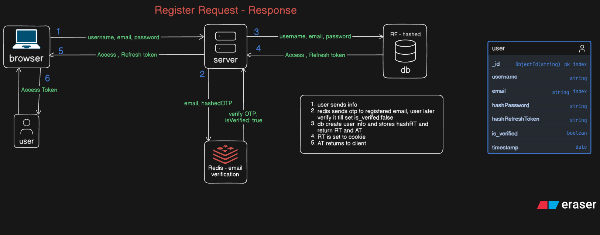
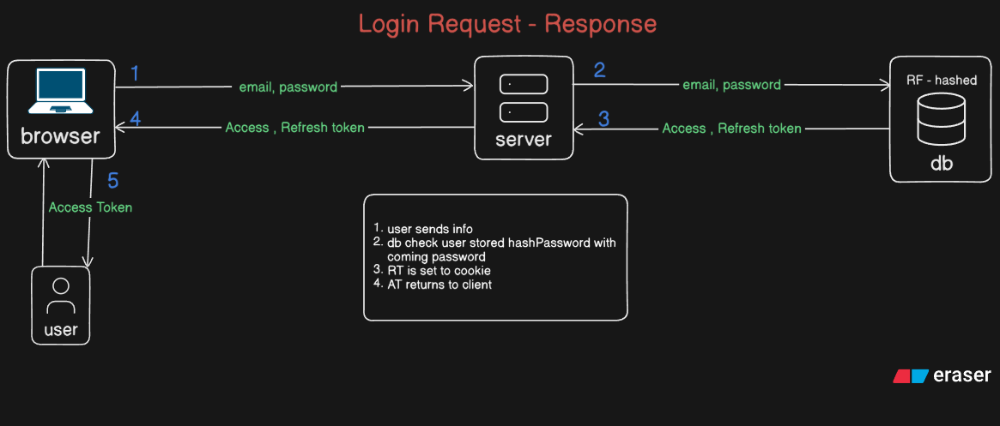
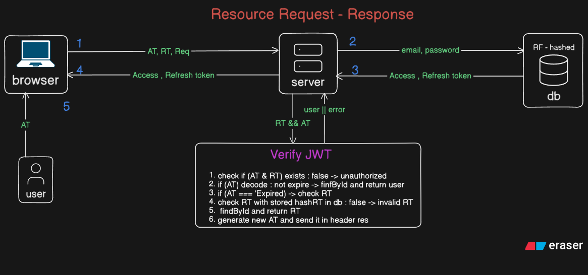

# 🔐 Complete Authentication System

This project demonstrates how modern authentication systems work by implementing secure user registration, login, email verification, protected routes, and session management.


## 🚀 Features

- User Registration
- Secure Password Hashing (bcrypt)
- Login Authentication
- JWT Access Token & Refresh Token
- HTTP-Only Cookie Authentication
- Email Verification using OTP
- OTP Storage with Redis
- Nodemailer Email Service
- Protected Routes
- User Profile
- Logout
- MongoDB User Management
- Production-style Authentication Flow


## 🔄 Authentication Flow

### Registration Flow 


### Login Flow


### Protected Route


### Email Verification

```text
User enters OTP
       │
       ▼
Check Redis
       │
       ├── Invalid OTP
       │
       ├── OTP Expired
       │
       ▼
Valid OTP
       │
       ▼
Mark User Verified
       │
       ▼
Delete OTP from Redis
```

## 💾 Why Redis?

Redis is used because OTPs are temporary.
Instead of storing OTPs inside MongoDB, they are stored in Redis with an expiration time.

Example:

```text
userId
    │
    ▼
482913
```

After 5 minutes:

```text
Automatically Deleted ✔
```

Benefits:

- Extremely fast
- Automatic expiration
- No manual cleanup
- Perfect for temporary data

## ⚙️ Environment Variables

```env
CORS_ORIGIN=
PORT=
MONGODB_URI=
MONGODB_DB_NAME=
REFRESH_TOKEN_SECRET=
REFRESH_TOKEN_EXPIRY=15d
ACCESS_TOKEN_SECRET=
ACCESS_TOKEN_EXPIRY=15m
GMAIL_CLIENT_ID=
GMAIL_CLIENT_SECRET=
GMAIL_REFRESH_TOKEN=
GMAIL_USER=jhaashutosh0811@gmail.com
```

## [Images](https://github.com/ashutoshJha-2025/complete-authentication-process/tree/main/Images)
- [Unverified Profile](https://github.com/ashutoshJha-2025/complete-authentication-process/tree/main/Images/Home.png)
- [Verified Profile](https://github.com/ashutoshJha-2025/complete-authentication-process/blob/main/Images/Verified.png)
- [Email Verification Mail](https://github.com/ashutoshJha-2025/complete-authentication-process/blob/main/Images/Verification_Mail.jpg)
- [Login Alert Mail](https://github.com/ashutoshJha-2025/complete-authentication-process/blob/main/Images/Login_Mail)
- [Logout Alert Mail](https://github.com/ashutoshJha-2025/complete-authentication-process/blob/main/Images/Logout_Mail)